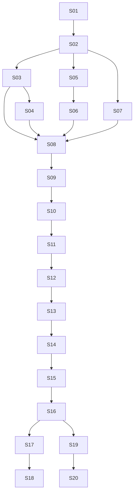

# Dependencias por sprint

Plan version: v2.1

| Sprint | Depende de | Entrega clave | Bloquea |
| --- | --- | --- | --- |
| S01 | - | repo+CI+fixtures | todo |
| S02 | S01 | types/errors/wire minimo | S03-S06 |
| S03 | S01,S02 | wrapper+ports E2E echo | S04-S08 |
| S04 | S03 | JSONL firewall + transient E2E | S05-S06-S14 |
| S05 | S02 | decoders+params | S06+S13 |
| S06 | S05 | interpolacion+$from+mapping | S08+S14 |
| S07 | S02 | port_pool puro | S08+S12 |
| S08 | S03+S06+S07 | continuous+SSE upstream | S11-S14 |
| S09 | S08 | StreamSink+safe_call | S14-S16 |
| S10 | S09 | core skeleton SSOTs | S11-S12 |
| S11 | S10 | AgentActor FSM+logs | S12-S15 |
| S12 | S11+S08 | Manager+factory+provision | S13-S14 |
| S13 | S12 | gateway /sys + auth + sources | S14-S16 |
| S14 | S13+S09 | interact nativo usable | release interna |
| S15 | S14 | artifacts + ui_proxy + regresion | S16 |
| S16 | S15 | AG-UI/A2UI/A2A completo | S17-S20 |
| S17 | S16 | CLI+daemon | S18 |
| S18 | S17 | graceful shutdown | S19 |
| S19 | S16 | hardening + git robust | S20 |
| S20 | S19 | landlock best-effort | v0 freeze |

